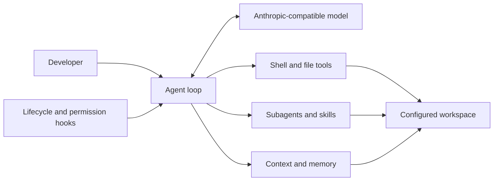

# InplusCode

[简体中文](README.zh-CN.md) | English

[](https://github.com/InplusLab-Agent/InplusCode/actions/workflows/ci.yml)
[](LICENSE)
[](https://www.python.org/)

InplusCode is a small, open-source coding agent that makes the agent loop easy to read, run, and change. It connects to the Anthropic API or a compatible endpoint, works inside a configurable local workspace, and can plan, inspect and edit files, run shell commands, load skills, delegate subtasks, compact long conversations, and retain project memory.

> InplusCode can execute shell commands and modify files. Review `config.yaml` before use, keep `permission.mode: strict` enabled unless you understand the risk, and run it only in a workspace you are prepared to let an agent change.

## Why InplusCode?

- **Understandable core:** the complete interactive agent loop lives in `InplusCode.py`.
- **Practical coding tools:** shell execution, file reading and writing, exact edits, glob search, and task planning.
- **Agent features without a large framework:** hooks, subagents, progressively loaded skills, streaming, context compaction, and persistent memory.
- **Provider flexibility:** use Anthropic directly or an Anthropic-compatible API through environment variables.
- **Workspace boundary:** file tools resolve paths inside the workspace configured in `config.yaml`.

## Architecture



## Quick start

### 1. Clone and install

```bash
git clone https://github.com/InplusLab-Agent/InplusCode.git
cd InplusCode
python -m venv .venv
```

Activate the environment:

```bash
# macOS / Linux
source .venv/bin/activate

# Windows PowerShell
.venv\Scripts\Activate.ps1
```

Install the dependencies:

```bash
python -m pip install -r requirements.txt
```

### 2. Configure the model

Copy `.env.example` to `.env`, then fill in your credentials and model ID:

```dotenv
ANTHROPIC_API_KEY=your-api-key
ANTHROPIC_BASE_URL=https://api.anthropic.com
MODEL_ID=your-model-id
```

For a compatible provider that authenticates with a bearer token, use `ANTHROPIC_AUTH_TOKEN` instead of `ANTHROPIC_API_KEY` and set the provider's base URL.

### 3. Choose the workspace

By default, InplusCode works in its own repository. To use it on another project, edit `config.yaml`:

```yaml
paths:
  workspace: ../my-project

permission:
  mode: strict
```

Relative workspace paths are resolved from the InplusCode repository root.

### 4. Run

```bash
python InplusCode.py
```

Type a request at `Input >>`. Enter `q`, `exit`, or an empty line to quit.

## Configuration

| Key | Purpose | Default |
| --- | --- | --- |
| `paths.workspace` | Directory available to the coding tools | `.` |
| `permission.mode` | `strict` prompts for risky operations; `off` disables these checks | `strict` |
| `streaming.show_thinking` | Show thinking blocks returned by the provider | `true` |
| `streaming.show_text` | Stream response text | `true` |
| `show_tool_use` | Print tool outputs | `false` |
| `context.show_usage` | Show context usage after responses | `true` |
| `context.window_tokens` | Context-window size used by the usage display | `200000` |

Runtime state, memories, transcripts, and large tool results are stored under `<workspace>/.inpluscode/` and are ignored by Git.

## Included skills

The `skills/` directory currently includes helpers for agent creation, code explanation, code review, skill creation, MCP server creation, PDF handling, and careful coding practices. The model first sees a compact skill catalog and loads the full instructions only when needed.

## Development and mirror policy

This repository is an automatically published mirror of [`scripts/`](https://github.com/InplusLab-Agent/learn-claude-code/tree/main/scripts) in the canonical [`InplusLab-Agent/learn-claude-code`](https://github.com/InplusLab-Agent/learn-claude-code) repository. Its commit history is derived from changes to that directory.

Please open issues here. For code changes, make the change against the canonical `scripts/` directory so that the next synchronization remains one-way and reproducible.

## License

InplusCode is available under the [MIT License](LICENSE).
