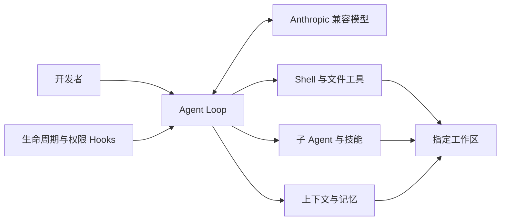

# InplusCode

简体中文 | [English](README.md)

[](https://github.com/InplusLab-Agent/InplusCode/actions/workflows/ci.yml)
[](LICENSE)
[](https://www.python.org/)

InplusCode 是一个小而清晰的开源 Coding Agent，核心目标是让 Agent Loop 易于阅读、运行和修改。它可以连接 Anthropic API 或兼容接口，在指定的本地工作区内进行任务规划、文件读写、Shell 命令执行、技能加载与子任务委派，并支持长上下文压缩和持久记忆。

> InplusCode 能够执行 Shell 命令和修改文件。使用前请检查 `config.yaml`；除非你清楚相关风险，请保持 `permission.mode: strict`，并仅在允许 Agent 修改的工作区中运行。

## 为什么选择 InplusCode？

- **核心清晰：** 完整的交互式 Agent Loop 集中在 `InplusCode.py` 中。
- **面向真实编码任务：** 支持命令执行、文件读取与写入、精确编辑、Glob 搜索和任务规划。
- **轻量但功能完整：** 内置生命周期 Hooks、子 Agent、渐进式技能加载、流式输出、上下文压缩和持久记忆。
- **模型接口灵活：** 既可直连 Anthropic，也可通过环境变量连接 Anthropic 兼容接口。
- **工作区边界：** 文件工具会在 `config.yaml` 指定的工作区中解析路径。

## 架构



## 快速开始

### 1. 克隆与安装

```bash
git clone https://github.com/InplusLab-Agent/InplusCode.git
cd InplusCode
python -m venv .venv
```

激活虚拟环境：

```bash
# macOS / Linux
source .venv/bin/activate

# Windows PowerShell
.venv\Scripts\Activate.ps1
```

安装依赖：

```bash
python -m pip install -r requirements.txt
```

### 2. 配置模型

复制 `.env.example` 为 `.env`，然后填写凭据和模型 ID：

```dotenv
ANTHROPIC_API_KEY=your-api-key
ANTHROPIC_BASE_URL=https://api.anthropic.com
MODEL_ID=your-model-id
```

如果兼容服务使用 Bearer Token 鉴权，请用 `ANTHROPIC_AUTH_TOKEN` 代替 `ANTHROPIC_API_KEY`，并填写该服务的 Base URL。

### 3. 选择工作区

InplusCode 默认操作自身仓库。若要让它处理另一个项目，请修改 `config.yaml`：

```yaml
paths:
  workspace: ../my-project

permission:
  mode: strict
```

相对工作区路径以 InplusCode 仓库根目录为基准解析。

### 4. 运行

```bash
python InplusCode.py
```

在 `Input >>` 后输入任务；输入 `q`、`exit` 或直接回车即可退出。

## 配置项

| 配置 | 作用 | 默认值 |
| --- | --- | --- |
| `paths.workspace` | Coding Agent 工具可操作的目录 | `.` |
| `permission.mode` | `strict` 会确认高风险操作；`off` 会关闭这些检查 | `strict` |
| `streaming.show_thinking` | 显示模型接口返回的 thinking 内容块 | `true` |
| `streaming.show_text` | 流式显示回答文本 | `true` |
| `show_tool_use` | 打印工具输出 | `false` |
| `context.show_usage` | 回答后显示上下文用量 | `true` |
| `context.window_tokens` | 用量显示使用的上下文窗口大小 | `200000` |

运行时状态、记忆、会话记录和大型工具结果保存在 `<workspace>/.inpluscode/` 中，并会被 Git 忽略。

## 内置技能

`skills/` 目录目前包含 Agent 创建、代码讲解、代码审查、技能创建、MCP Server 创建、PDF 处理和谨慎编码等辅助能力。模型启动时只接收精简的技能目录，在需要时再加载完整说明。

## 开发与镜像策略

本仓库由主开发仓库 [`InplusLab-Agent/learn-claude-code`](https://github.com/InplusLab-Agent/learn-claude-code) 中的 [`scripts/`](https://github.com/InplusLab-Agent/learn-claude-code/tree/main/scripts) 目录自动发布，提交历史也由该目录的变更生成。

问题可以直接提交到本仓库。代码修改请面向主仓库的 `scripts/` 目录发起，以确保后续单向同步保持稳定且可复现。

## 开源协议

InplusCode 采用 [MIT License](LICENSE) 开源。
